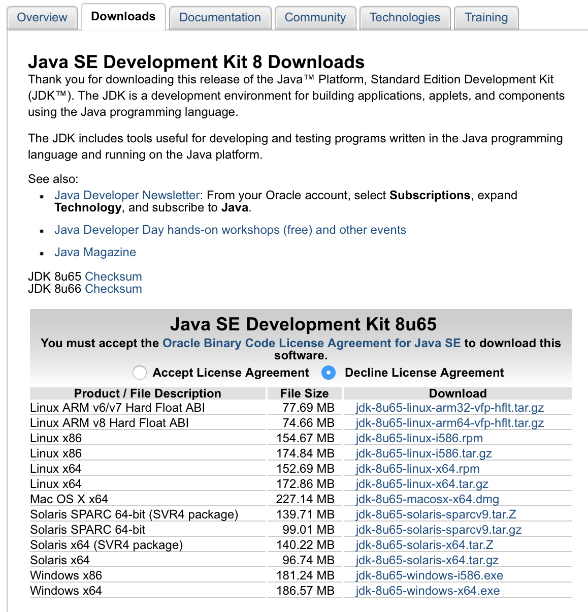
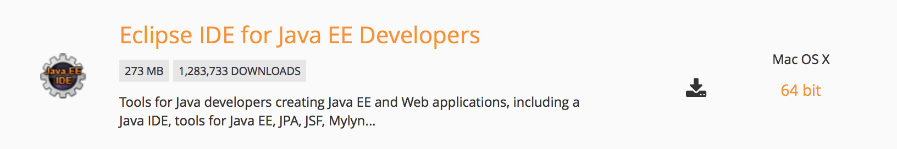
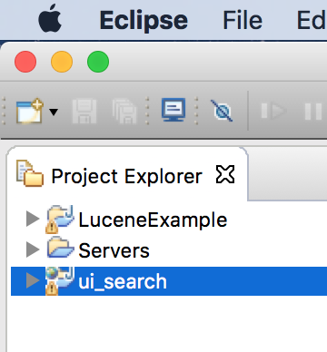
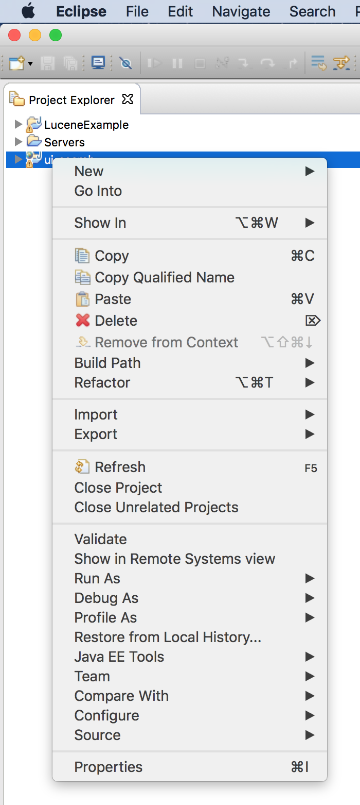
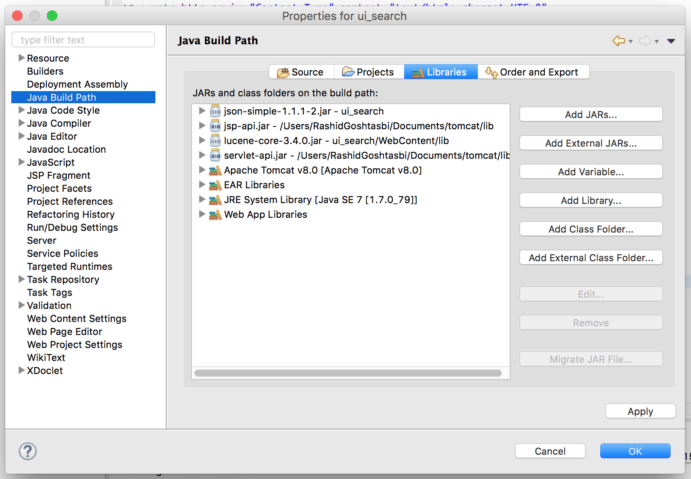
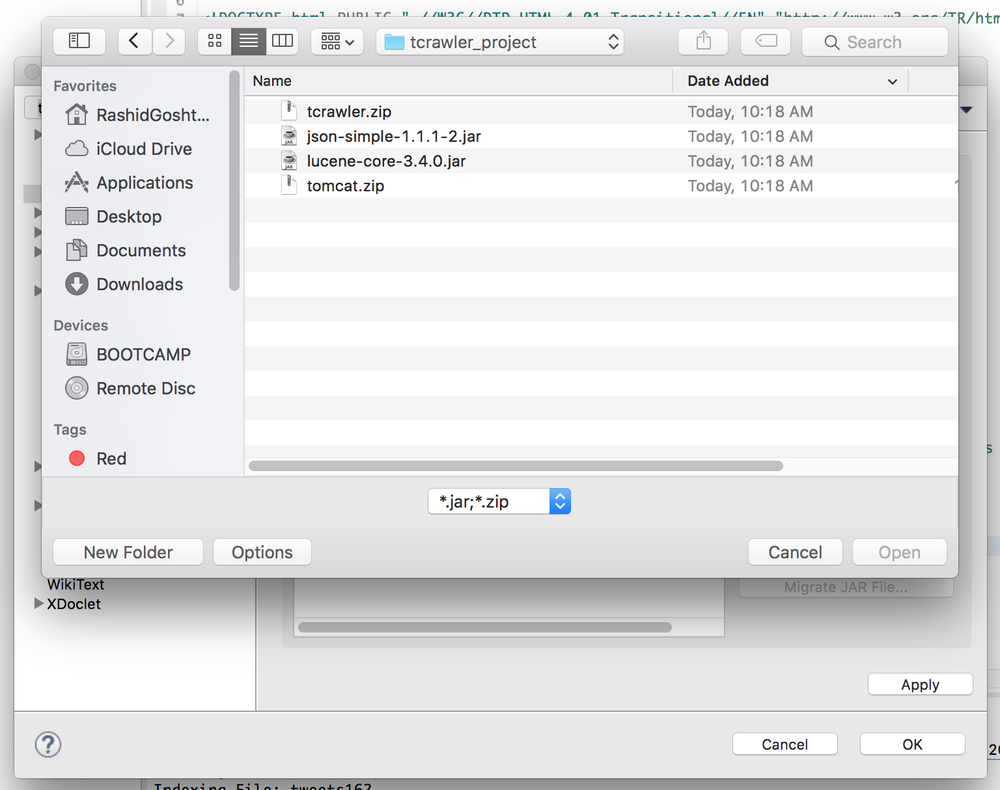
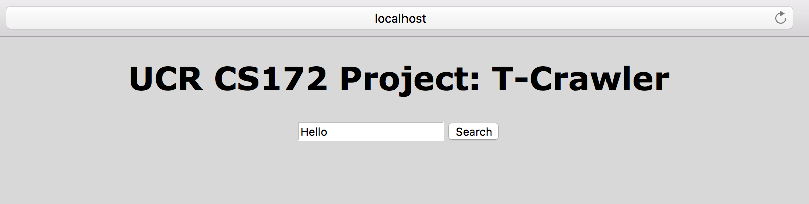
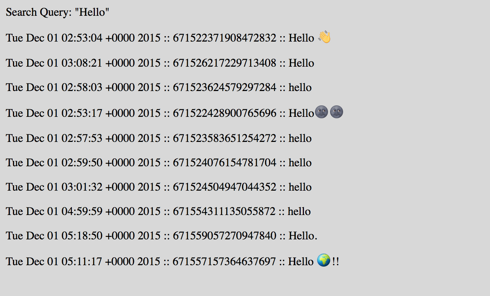
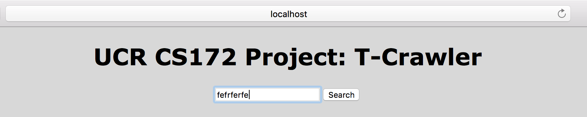
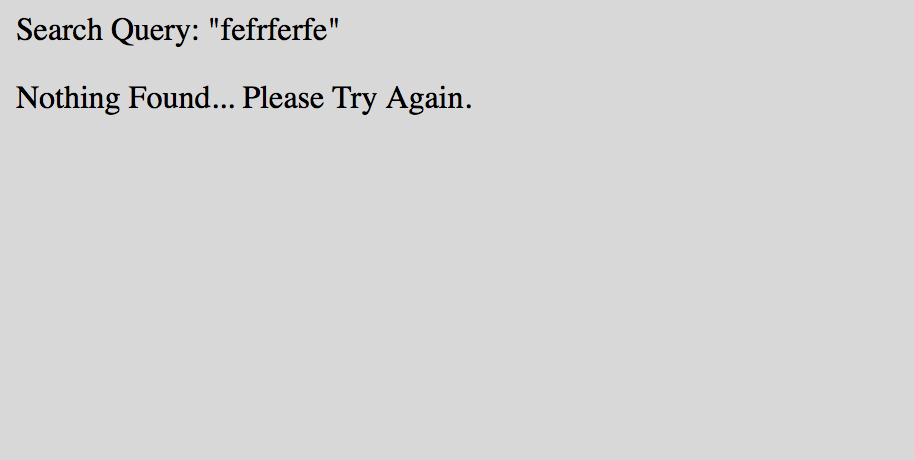

# Twitter Search Engine
### Brendan Cheng and Rashid Goshtasbi

Hello there! TSearchEngine is an open source project for Linux to download tweets over twitter that has geolocation enabled. These tweets are indexed and can be retrieved by search through a Java servlet that acts as a search engine.

##Collaboration Details
Description of contributions of each team member

###Brendan
* Researched on how to configure Apache Tomcat with Eclipse
* Researched on how .XML, .JSP, and .Java files interact
* Configured server host for Tomcat
* Ranked indexes based on search query
* Setup XML file to deploy descriptors for our servlet
* Configured .JSP and .HTML files to create a UI interface
* Convert JSON objects to strings
* Setup string values for index search by concatenation
* Files: LuceneExample.java, textOutput.java, search\_engine.jsp, web.xml, search.html

###Rashid
* Researched on how to configure Apache Tomcat with Eclipse
* Researched on how .XML, .JSP, and .Java files interact
* Configured server host for Tomcat
* Configured internal and external .jar libraries
* Ranked indexes based on search query
* Configure Lucene to accept JSON Files
* Convert JSON objects to strings
* Setup string values for index search algorithm to pass from .java to .jsp files to display to webpage
* Setup core .jar libraries
* Files: LuceneExample.java, textOutput.java, search\_engine.jsp, json.jar, lucene.jar

##Overview of System
* **Architecture:**
  * LuceneExample.java:
  		* WebDocument class
  			* Organizes string of id, text, and created at for storing into index files
		* Main goes through each JSON file and casts it into an object variable to allow for parsing into an index
		* ReadJSON
			* Takes in the files at directory location and retrieves each type of object file such as created at, id, and twitter text.
			* sends in the string values of created at, id, and twitter text and passes it into the WebDocument class and then index's that information
		* Index Class
			* Indexes the information from WebDocument and creates fields to read for the search
  * web.xml:
  		* Deploys descriptor for our Java servlet
  	* search\_engine.jsp:
  		* Accepts ranked indexes and outputs results
  * search.html:
   		* Provides the interface for our Java Servlet
   		* Text box, search button, headers, titles, background colors
  * textOutput.java
   		* Ranks the indexes
   		* Takes the variable that the user types into the search engine box and uses those words in a query and searches the index for the top 10 relevant tweets and outputs it on the screen for the user to see
* **Index Structures**
 * We take an input reader that reads the json data files at the specified location
 * From there we input each line of the json file and insert the line into an function of ArrayList of JSON Object files
 * There we cast each object we need into a string and pass those into a class provided from our TA that will create a "page"
 * Afterwards we pass that page into our index function
 * There we manipulated this function to create fields such as "text", "id", "username", and "created at" so we can later pull them when we are searching for words from our query.
 * We modify the way Lucene indexes our tweets through the use of .setBoost(). Through the use of this function, we assign each field of our tweets with a weight in order to give priority to text, followed by id.
* **Search Algorithm**
 * We use the built-in functionality of Lucene. Lucene indexes our files by breaking our tweets into terms that are generated using a built-in analyzer. An index file is created to contain these terms. When a query is received, it is processed through the same analyzer to look for matching terms within the index file. A list of tweets that have a match with the query is then created. 

* **Libraries:**
 * Java.io
 * Java.lang
 * Java.util
 * JSON Simple
 * Apache Lucene
 * Tomcat
 * Java Server Pages
 

##Limitations
* Biggest limitation was for us to parse JSON array objects which carried more information such as location to use google maps API
* Need to install all relevant libraries
* Returns 10 search results, no additional pages of results
* Results are tweets, not links
* Formatting of the outputs aren't simplified, uses "::" to spread the created dates, user id and tweet text

##Instructions

###Installation and Running of Tcrawler on Eclipse Browser and/or LocalHost Browser "localhost:8080/ui_search/search.html"
1. Take our tcrawler_project.zip folder and un-zip it to a location that is easily accessible for you.
2. Unzip Apache Tomcat file from our tcrawler\_project
 * Our Tomcat file has been modified to include lucene.jar file library to handle exceptions.
 * If you wish to use a different Tomcat file, it will not handle exceptions in our servlet
3. Download Java SE Development Kit from: http://www.oracle.com/technetwork/java/javase/downloads/jdk8-downloads-2133151.html
 * Version 8 is preferred with our program
Inline-style: 

-
4. Install Eclipse from: https://eclipse.org/downloads/
Inline-style: 

-
5. Import tcrawler project into Eclipse
 * Open eclipse and select File > Import > General > Archive File and click next and under "From archive file:" select the tcrawler.zip file in the provided tcrawler_project folder you un-zipped earlier. Eclipse will import the .zip as "ui_search" in your Eclipse workspace.
 * On our workspace, select the Servers tab and select the option to create a new server. Select Tomcatv8.0, then select the Tomcat directory we provided for you.
 * After the server is created, you will see it listed under the servers tab. Right click and go to Properties, and click on "change the location." Apply and press ok.
 * Under the server tab, Double click the server listed for Tomcat and under Server Locations, select the option for "Use Tomcat installation(takes control of Tomcat installation). Make sure the port name HTTP.1.1 corresponds to the 8080 Port Number.
6. Importing .jar file libraries for project files
 * Select the project folder for ui_search in Eclipse, right-click and select properties.
 * Under "Java Build Path," select "Add External JARs..." and select the two .jar file included in the zip folder we provided you.
 * Click "Apply", then "OK".

-

-

-

-
8. Inside textOutput.java and LuceneExample.java please change "INDEX_DIR" to be pointing to your output folder for where you want to store your index and where your JSON data files are currently located at, respectively.
7. Running the project
 * Under the project folder in Eclipse, open ui_search > WebContent > right-click the "search.html" file > "Run As" > "Run on Server"
 * A new window should open up and select "Finish".
 * Eclipse will compile the project and webpages relevant files and will open up a new browser window in Eclipse. In there the search bar and search function will show.

 
IF YOU WANT TO RUN TCRAWLER FROM TOMCAT'S LOCALHOST TERMINAL:

1. Navigate to directory with Tomcat folder
2. type: sudo chown -R Tomcat
3. sudo chmod +x Tomcat/bin/*.sh
4. To start tomcat, type: Tomcat/bin/startup.sh
5. In your browser, type in "localhost:8080"
6. You will be directed to the Tomcat page.
7. Then in the url bar, type: **localhost:8080/ui_search/search.html**
8. This is the WebApp created in Eclipse
5. To shutdown tomcat, type: Tomcat/bin/shutdown.sh

##Images In Action

-

-

-

